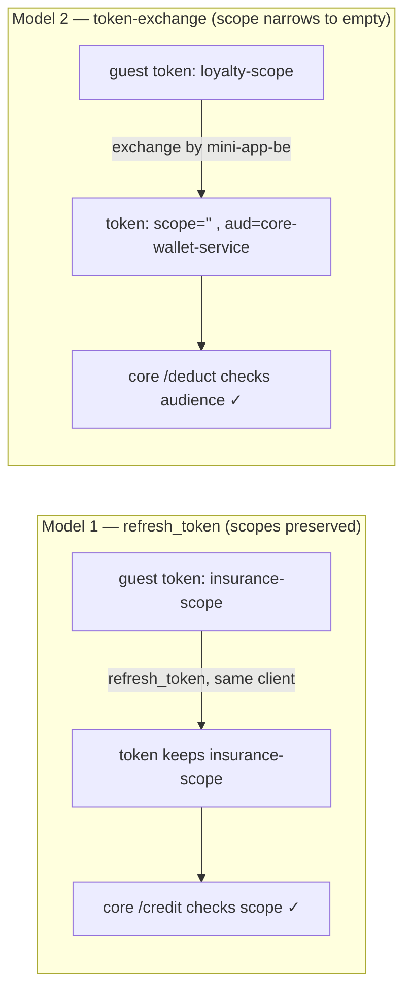

# Mini App Ecosystem - Local Proof-of-Concept (POC)

This is a complete, fully executable local Proof-of-Concept demonstrating the **Secure JS-Bridge Promise Handshake**, **Keycloak Token Exchange (RFC 8693)**, **Centralized Ingress Token Offloading**, and **Trusted Downstream Header Propagation** inside a unified multi-service architecture.

---

## 1. Architectural Components

1. **Flutter Host App (`flutter-host`)**: Native shell hosting the Guest Web App WebView. Simulates native Keycloak user logins and exposes the Dart `SecureJSBridge` which intercepts calls, performs Keycloak exchanges, and resolves JS Promises.
2. **Guest Web App (`guest-webapp`)**: Glassmorphic single-page application served via NGINX on port 5000 (acting as our CDN). Implements the JS SDK Promise registry and fires API calls.
3. **Keycloak (`poc-keycloak`)**: Pre-configured IAM broker served on port 8080 containing the realm, clients, scopes, and test users.
4. **API Gateway (`core-gateway`)**: Spring Cloud Gateway served on port 9000. Acts as the edge ingress, validating incoming Keycloak JWTs and propagating trusted headers downstream.
5. **Core Backend (`core-be`)**: Light Spring Boot service served on port 8082 with zero security library overhead. Processes wallet deductions by reading trusted headers directly.
6. **Mini App Backend (`mini-app-be`)**: Spring Boot service served on port 8081. Executes the **Two-Step Backend Pattern** (OIDC token exchange swap at Keycloak + Core Gateway execution call).

---

## 1a. Two Authorization Models

This POC demonstrates **two distinct delegation models**, each authorizing on the signal that is actually reliable for that flow.

| | **Model 1 — Scope Preserved** | **Model 2 — Token Exchange** |
|---|---|---|
| Example mini app | Insurance Points (`points.html`) | Loyalty Rewards (`index.html`) |
| Keycloak grant | `refresh_token` scope-down (same client) | `urn:ietf:params:oauth:grant-type:token-exchange` (RFC 8693) |
| Who elevates | Flutter host re-issues a narrowed user token | `mini-app-be` exchanges the guest micro-token for a wallet-targeted token |
| `scope` claim in final token | **Preserved** (e.g. `insurance-scope`) | **Empty** — exchange can only *narrow* the subject's scopes, and the guest token never held `wallet-scope` |
| `aud` claim in final token | client default | `core-wallet-service` (set by the `wallet-scope` audience mapper) |
| Authorization signal at `core-be` | `X-User-Scopes` contains the scope | `X-Token-Audience` contains `core-wallet-service` |

### Why Model 2 authorizes on audience, not scope

Keycloak **legacy token-exchange** (`24.0.2` here) issues a token whose `scope` is the **intersection** of the subject token's scopes and the requesting client's scopes. The guest micro-token only carries `loyalty-scope`, so requesting `wallet-scope` yields an **empty** `scope` claim — no realm toggle can add a scope the subject never had.

The correct authorization signal for this hop is the **`aud` (audience)** claim: the exchanged token is minted **specifically for** `core-wallet-service`, and only `mini-app-loyalty-rewards` is permitted to perform that exchange. The gateway forwards this as the `X-Token-Audience` header, and `core-be` accepts the call when **either** `wallet-scope` is present **or** the audience targets `core-wallet-service`. This preserves the guest/backend privilege boundary — the guest webview never receives a wallet-capable token.



---

## 2. Booting the Core Cloud Infrastructure (Docker Compose)

Navigate into the POC folder and launch all containerized cloud components:

```bash
cd local-mini-app-poc
docker compose up --build -d
```

### Services Status Verification:
* **Keycloak (IAM Port 8080):** Keycloak will boot up and automatically import the realm configurations. You can access the Keycloak Console at [http://localhost:8080](http://localhost:8080) (Admin Credentials: `admin` / `adminpassword`).
* **Guest CDN (Port 5000):** You can preview the raw static Guest app directly at [http://localhost:5000](http://localhost:5000). *(Note: It will display a "WebView Host Context not found" error if loaded directly in a standard browser since it requires the Flutter JS-Bridge).*
* **API Gateway (Port 9000):** Spring Cloud Gateway running in the backend, connected to Keycloak JWKS.
* **Spring Boot Backends (Ports 8081 & 8082):** Clean, ready services.

---

## 3. Running the Flutter Host App

Ensure your workspace environment variables are set and run the Flutter mobile shell locally:

```bash
cd flutter-host
flutter pub get
flutter run -d chrome
```

*(Note: Running on Chrome via `-d chrome` is the fastest way to test on a local workstation as it shares localhost networking with Docker perfectly. If compiling to Android or iOS simulators, update the Keycloak and Backend hosts in `lib/main.dart` from `localhost` to `10.0.2.2`).*

---

## 4. Executing the Token Validation Flow (Step-by-Step)

Once the Flutter Host App launches on your desktop:

### Step 1: User Login
Upon boot, the Flutter Host App will automatically execute a native programmatic Keycloak login for `testuser` (password: `password`). Look at the **Platform Telemetry Logs** panel in the top half of the screen; it will log `Master JWT obtained`.

### Step 2: JS-Bridge Token Exchange Handshake
1. In the bottom half of the screen (the Guest WebView), click **"1. Request Scoped Token from Host App"**.
2. **Watch the Telemetry Logs:** The Guest App creates a pending JavaScript Promise. Flutter intercepts this bridge payload, connects backchannel to Keycloak, executes a Token Exchange requesting `loyalty-scope`, obtains the Scoped Micro-JWT, and executes `evaluateJavascript` back into the WebView.
3. The JavaScript Promise resolves immediately, returning the token string.

### Step 3: Two-Step Backend Verification Call
1. Click **"2. Claim Premium Insurance Gift"** in the WebView.
2. The WebApp calls the Mini App Backend (`mini-app-be`) on port 8081, supplying the Micro-token in the Bearer header.
3. **The Backend Dance:** 
   * **Call 1 (Swap):** The Mini App Backend calls Keycloak’s token endpoint, swapping the Micro-JWT for a Delegated Core JWT.
   * **Call 2 (Execute):** The Mini App Backend forwards the transaction to the Core Gateway on port 9000 supplying the Core JWT.
   * **Gateway Magic:** The Spring Cloud Gateway validates the token signature against Keycloak JWKS, strips the token, injects trusted headers, and routes it to `core-be`.
4. The transaction succeeds, returning the deducted balance dynamically to your WebView screen!

---

## 5. Inspecting Ingress Header Propagation Logs

To verify that the microservices received the identity headers without performing any local JWT parsing or security validation, inspect the logs of your running Core Backend container:

```bash
docker logs -f poc-core-be
```

You will see the clean HTTP header propagation printed natively.

**Model 2 (Loyalty Rewards — token exchange):** note the empty `X-User-Scopes` and the populated `X-Token-Audience`, which is what authorizes the call:

```text
====== CORE AKS BACKEND RECEIVED CALL ======
X-User-Id    (User UUID)     : c6b8b0e8-07e1-4cbb-9273-95629c426639
X-Client-Id  (Calling Client): mini-app-loyalty-rewards
X-User-Scopes(Active Scopes) :
X-Token-Audience (Intended)  : core-wallet-service
==========================================
Deducting 100 points for User c6b8b0e8-07e1-4cbb-9273-95629c426639 via mini-app-loyalty-rewards
```

**Model 1 (Insurance Points — refresh-token scope-down):** here the scope is preserved and authorizes the call:

```text
====== CORE AKS BACKEND RECEIVED CREDIT CALL ======
X-User-Id    (User UUID)     : c6b8b0e8-07e1-4cbb-9273-95629c426639
X-Client-Id  (Calling Client): flutter-host-app
X-User-Scopes(Active Scopes) : loyalty-scope insurance-scope
==========================================
```

---

## 6. Shutdown
To stop and clean up the Docker containers:

```bash
docker compose down
```
