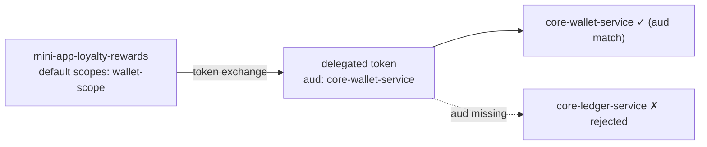

# GMA Mini App Onboarding Standards (Keycloak)

**Audience:** Keycloak Administrators (GMA Platform Team) and 3rd-Party Mini App Developers
**Scope:** Identity, client registration, authorization scopes, and token-exchange access to GMA Core microservices
**Status:** Baseline standard — supersedes ad-hoc client creation

---

## 1. Guiding Principles

| # | Principle | What it means in practice |
|---|---|---|
| 1 | **Least privilege** | A Mini App is granted access **only** to the specific Core services it needs — never a blanket "all services" scope. |
| 2 | **Authorize on audience (`aud`)** | A Core service trusts a call when the token's `aud` names that service. The per-Mini-App allow-list of audiences is the access-control list. |
| 3 | **Client-level, not user-level, authorization** | "May Mini App X call Service Y?" is a property of the **client**, not the user. It is modeled with **client scopes**, never Keycloak user groups/roles. |
| 4 | **One scope per Core service** | Each Core microservice has exactly one dedicated client scope that stamps that service's audience. No multi-service "god scopes." |
| 5 | **Confidential backends only for elevation** | Privilege elevation (token exchange) is performed by a confidential **Mini App backend**, never by the public guest WebView/host. |
| 6 | **No standing secrets in the client** | Guest WebViews receive short-lived, narrowly-scoped micro-tokens only. Secrets live in the Mini App backend. |

---

## 2. Naming Conventions

Consistent names are mandatory — automation, auditing, and reviews depend on them.

| Object | Pattern | Example | Notes |
|---|---|---|---|
| Core service client | `core-<domain>-service` | `core-wallet-service` | Resource server; one per Core microservice. |
| Core service scope | `<domain>-scope` | `wallet-scope` | Stamps `aud: core-<domain>-service`. |
| Mini App backend client | `mini-app-<vendor>-<app>` | `mini-app-loyalty-rewards` | Confidential; performs token exchange. |
| Mini App identifier (bridge) | `com.<vendor>.<app>` | `com.vendor.loyalty-rewards` | Used by the host JS-Bridge to select a flow. |
| Host shell client | `<platform>-host-app` | `flutter-host-app` | Public client; user login + scope-down. |
| Audience mapper | `<domain>-audience-mapper` | `wallet-audience-mapper` | One per Core service scope. |

**Rules**
- All identifiers are **lowercase, hyphen-separated** (`kebab-case`).
- `<domain>` is the Core business domain (`wallet`, `insurance`, `ledger`, `kyc`, …) and must be unique.
- `<vendor>` is the registered 3rd-party vendor short code.
- Scope name and the service it targets must correspond 1:1 (`wallet-scope` → `core-wallet-service`).

---

## 3. Core Service Client Scope (Admin-owned template)

For **every** Core microservice, the Platform Team defines exactly one client scope with an audience mapper. This is the single source of the `aud` claim used for authorization.

```json
{
  "name": "wallet-scope",
  "protocol": "openid-connect",
  "attributes": {
    "display.on.consent.screen": "true",
    "consent.screen.text": "Access core wallet service"
  },
  "protocolMappers": [
    {
      "name": "wallet-audience-mapper",
      "protocol": "openid-connect",
      "protocolMapper": "oidc-audience-mapper",
      "consentRequired": false,
      "config": {
        "included.client.audience": "core-wallet-service",
        "id.token.claim": "false",
        "access.token.claim": "true"
      }
    }
  ]
}
```

**Standard rules for Core scopes**
- `included.client.audience` **must** be the Core service's own client ID.
- `access.token.claim` = `true`, `id.token.claim` = `false` (audience belongs in the access token only).
- **Do not** set `include.in.token.scope`. It defaults to Keycloak's behavior and is irrelevant — Core services authorize on `aud`, not the `scope` string (see §7).
- A Core scope is **owned and created by the Platform Team only**. 3rd-party devs request assignment; they never define Core scopes.

---

## 4. Registering a Mini App (Step-by-step for the Keycloak Admin)

When onboarding a new Mini App, the Admin performs the following.

### 4.1 Create the confidential backend client
```json
{
  "clientId": "mini-app-<vendor>-<app>",
  "enabled": true,
  "secret": "<generated-strong-secret>",
  "publicClient": false,
  "serviceAccountsEnabled": true,
  "directAccessGrantsEnabled": false,
  "standardFlowEnabled": false,
  "protocol": "openid-connect",
  "optionalClientScopes": [],
  "defaultClientScopes": [ "<service-a>-scope", "<service-b>-scope" ]
}
```

- `defaultClientScopes` is the Mini App's **allow-list** — list **only** the Core services this app is approved to call.
- Disable every flow the app does not use (`standardFlowEnabled`, `directAccessGrantsEnabled` off unless justified).
- Generate the secret in Keycloak; deliver it to the vendor over a secure channel (never email/commit).

### 4.2 Grant token-exchange permission
- **Keycloak 26.2+ (preferred):** enable **Standard Token Exchange** on the Mini App client's *Capability config*. Permission lives on the **requesting** client — no per-Core-service configuration.
- **Legacy (≤ 25 / feature `token-exchange`):** on each target `core-<domain>-service`, under **Permissions → token-exchange**, grant the Mini App client. Repeat per target service.

### 4.3 Record the onboarding
- Log the Mini App ID, vendor, approved scopes, and approver in the access registry (see §8 checklist).

---

## 5. Mini App Access Matrix (least privilege in action)

Maintain an explicit matrix. Each Mini App gets only the columns it needs.

| Mini App client | `wallet-scope` | `insurance-scope` | `ledger-scope` | `kyc-scope` |
|---|:---:|:---:|:---:|:---:|
| `mini-app-loyalty-rewards` | ✅ | | | |
| `mini-app-insurance-points` | | ✅ | ✅ | |
| `mini-app-super-finance` | ✅ | ✅ | ✅ | ✅ |

> A Mini App needing 10 services is assigned 10 scopes; an app needing 1 is assigned 1. The assigned set **is** the capability list and is enforced at token-mint time.



---

## 6. Token Flows (what 3rd-party devs implement)

There are two supported delegation models. Choose per Mini App based on whether it calls Core services through its own backend.

### Model 1 — Scope-preserving (refresh-token scope-down)
- The host re-issues a **narrowed user token** for a single-domain app that talks to one service directly.
- The `scope` claim is **preserved**; the Core service may authorize on either scope or audience.

### Model 2 — Token Exchange (RFC 8693) — default for backend-mediated apps
1. Guest WebView requests a narrowly-scoped micro-token from the host bridge (e.g. `loyalty-scope`).
2. Guest calls its **Mini App backend** with that micro-token as `Bearer`.
3. Mini App backend performs a **token exchange** at Keycloak:
   - authenticates with its own client credentials (Basic auth),
   - `subject_token` = the guest micro-token,
   - `audience` = the target Core service (e.g. `core-wallet-service`),
   - **omit the `scope` parameter** (see §7).
4. Backend calls the Core API Gateway with the delegated token; the Gateway validates and forwards trusted headers (`X-User-Id`, `X-Client-Id`, `X-Token-Audience`).
5. The Core service authorizes on `aud`.

**Exchange request (form-encoded):**
```
grant_type=urn:ietf:params:oauth:grant-type:token-exchange
subject_token=<guest-micro-token>
subject_token_type=urn:ietf:params:oauth:token-type:access_token
audience=core-wallet-service
```

---

## 7. Critical Rule: Authorize on Audience, not Scope

> **Legacy Keycloak token exchange can only _narrow_ scopes — it cannot _add_ a scope the subject token never held.**

The guest micro-token carries only the app's own scope (e.g. `loyalty-scope`). Requesting `scope=wallet-scope` during exchange yields an **empty** `scope` claim, because the result is the intersection `{loyalty-scope} ∩ {wallet-scope} = {}`. **No realm toggle changes this.**

Therefore:
- **Do not** pass an explicit `scope` parameter expecting a new scope to appear.
- The audience mapper still runs, stamping `aud: core-<service>`. That `aud` is the authoritative access-control signal.
- The Gateway forwards it as `X-Token-Audience`; each Core service checks `aud.contains("<its-own-client-id>")`.

> On **Keycloak 26.2+ Standard Token Exchange**, scope handling is improved, but the **audience-based authorization model in this standard remains the contract** so Core services stay version-independent.

---

## 8. Onboarding Checklist

**Platform / Keycloak Admin**
- [ ] Core service has a `core-<domain>-service` client and a matching `<domain>-scope` with audience mapper (§3).
- [ ] Mini App confidential client created with correct naming (§2, §4.1).
- [ ] `defaultClientScopes` set to the **approved minimum** allow-list (§4.1, §5).
- [ ] Unused flows disabled (`standardFlowEnabled`, `directAccessGrantsEnabled`).
- [ ] Token-exchange permission granted per version (§4.2).
- [ ] Secret generated in Keycloak and delivered over a secure channel.
- [ ] Access matrix and approver recorded (§5).

**3rd-Party Developer**
- [ ] Store the client secret only in the backend secret manager — never in the guest WebView, repo, or client config.
- [ ] Request from the host bridge only the **minimum** scope the app needs.
- [ ] In the exchange call, set `audience` to the target Core service and **omit `scope`** (§6, §7).
- [ ] Never call Core services directly from the guest WebView — always via the Mini App backend.
- [ ] Handle token expiry/refresh in the backend; do not cache long-lived Core tokens.
- [ ] Submit the list of Core services your app needs for approval **before** requesting scope assignment.

---

## 9. Anti-Patterns (do not do)

| Anti-pattern | Why it's rejected | Correct approach |
|---|---|---|
| A single `gma-core-services` scope granting all services | Violates least privilege; one leaked secret = full blast radius | One scope per Core service; assign only what's needed (§5) |
| Modeling Mini-App→Service access as Keycloak **user groups/roles** | Wrong abstraction — this is client→resource, not user→role | Per-app `defaultClientScopes` allow-list (§4.1) |
| Passing `scope=<other-service>-scope` in exchange to "gain" access | Exchange narrows, not adds — yields empty scope | Authorize on `aud` (§7) |
| Putting the client secret in the guest WebView/host | Public surface; secret theft | Secret stays in the confidential backend (§1.6) |
| Core service parsing/trusting the raw user JWT directly | Bypasses Gateway offload and audience checks | Trust Gateway-injected `X-*` headers (§6) |
| Reusing one shared backend client for multiple unrelated Mini Apps | Breaks per-app least privilege and auditing | One confidential client per Mini App (§4.1) |

---

## 10. Quick Reference — Adding a New Core Service

1. Create client `core-<domain>-service` (confidential resource server).
2. Create client scope `<domain>-scope` with a `<domain>-audience-mapper` → `aud: core-<domain>-service` (§3).
3. Implement the `aud.contains("core-<domain>-service")` authorization check in that service (no new Gateway code needed).
4. Assign `<domain>-scope` to each Mini App approved for it; grant token-exchange permission per version (§4.2).

This scales to any number of Core services with **configuration only** — no per-service Gateway changes.
